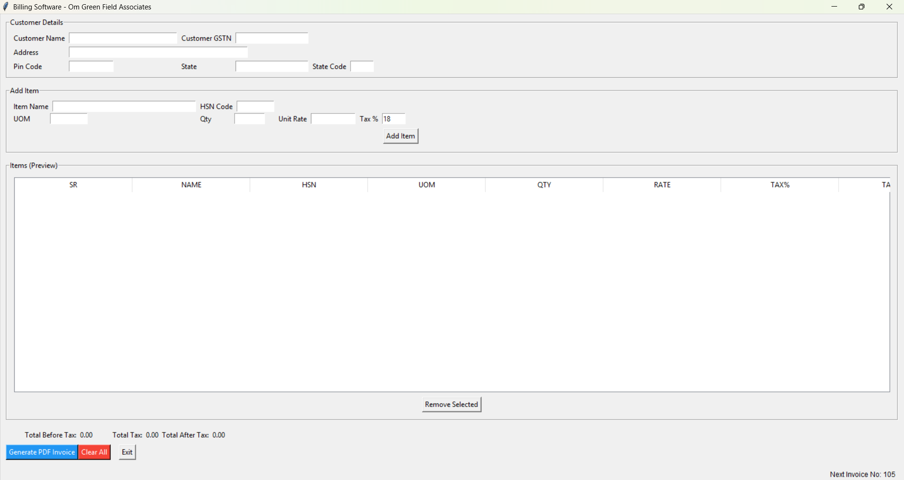
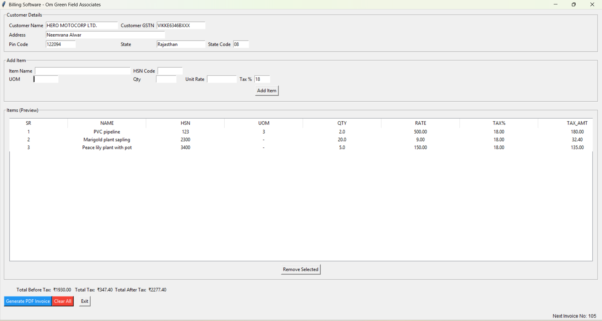
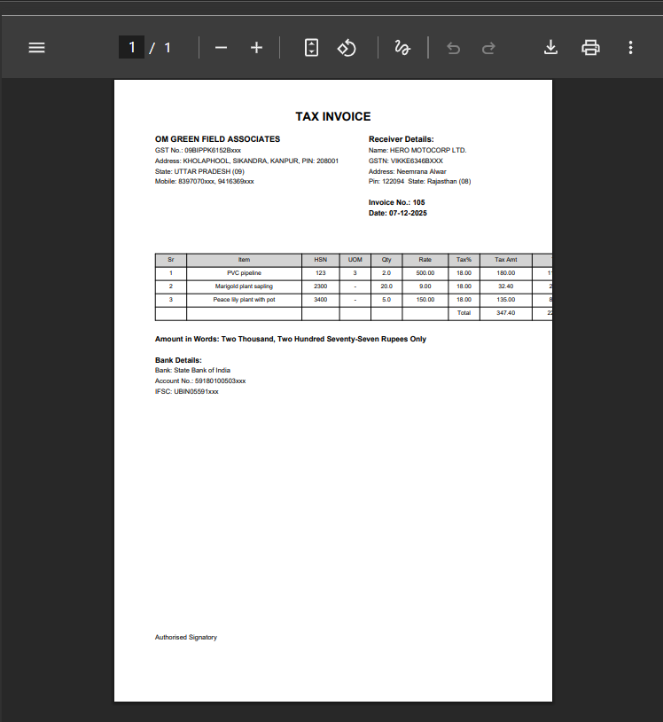

# Python Billing Management System

A Python-based billing management system developed using Jupyter Notebook.

## Features
- Generate customer bills
- Calculate totals automatically
- Manage item pricing
- Display formatted invoices
- Simple user interaction system

## Technologies Used
- Python
- Jupyter Notebook

## Repository Structure

* `billing-main.ipynb`: The core Python source code, UI logic, and PDF generation workflow.
* `requirements.txt`: List of external dependencies required to run the project.
* `*.png`: Visual walkthrough screenshots of the working software.

## Project Workflow
1. User enters product details
2. System calculates totals
3. Invoice is generated automatically

## Application Preview

### 1. Main Application Layout

### 2. User Input & Bill Calculation

### 3. Generated Sample Invoice PDF

## Future Improvements
- Database integration
- Automated Invoice Generation: Computes item totals, taxes, and balances instantly.
- PDF Export: Generates professional, print-ready sample invoice PDFs.

## Author
Swarnim
